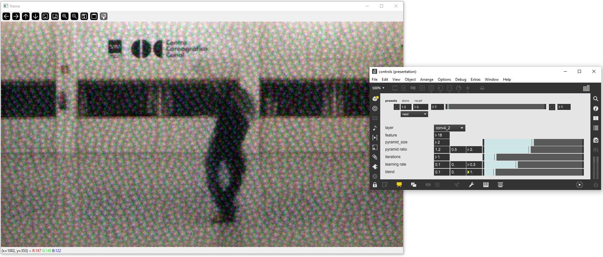

# AI-Toolbox - Motion Visualisation - Image Deep Dream



Figure 1. Screenshot of the Image Deep Dream tool. The window on the left shows the output of the tool that is applied to video recording of a dance rehearsal.  The window on the right is a Max/MSP patch that demonstrates how to send OSC messages to control the Image Deep Dream tool. 

## Summary

This Python-based tool implements the classical Deep Dream method to process video images in real-time. The video images can either be captured by a camera in real-time or extracted from a movie recording. The tool employs a pretrained image classification model (VGG16).   The tool can be interactively controlled by sending it OSC messages. 

### Installation

The tool runs within the *premiere* anaconda environment. For this reason, this environment has to be setup beforehand.  Instructions how to setup the *premiere* environment are available as part of the [installation documentation ](https://github.com/bisnad/AIToolbox/tree/main/Installers) in the [AI Toolbox github repository](https://github.com/bisnad/AIToolbox). 

The tool can be downloaded by cloning the [MotionVisualisation repository](..). After cloning, the tool is located in the MotionVisualisation / ImageDeepdream directory. 

### Directory Structure

ImageDeepdream (contains tool specific python scripts)

- controls (contains an example Max/MSP patch for interactively controlling the tool)
- data
  - media (contains media used in this Readme)


## Usage
#### Start

The tool can be started either by double clicking the `deepdream.bat` (Windows) or `deepdream.sh` (MacOS) shell scripts or by typing the following commands into the Anaconda terminal:

```
conda activate premiere
cd MotionVisualisation
python deepdream.py
```

During startup, the tool loads the model weights from a pretrained image classification model (VGG16) and, depending on the tool's configuration, also loads movie file. By default, the tool captures video images live from a webcam at a resolution of 1280 x 720 pixels. To switch from live camera to a movie recording or to change the image resolution, the following source code has to be modified in the file `deepdream.py.` 

```
image_resolution = (1280, 720)
use_live_camera_input = True
movie_file_path = "../../../Data/Video/Stocos/Solos/Take4_Blumen_Baile.mp4"
```

The tuple of integer values assigned to the variable `image_resolution` specifies the resolution of the video image that will be processed with the Deep Dream method. The boolean value assigned to the variable `use_live_camera_input` specifies if the video images should be loaded from a movie file or captured live using a camera. The string value assigned to the variable `movie_file_path` specifies the path to a movie recording that will be loaded when the variable `use_live_camera_input` is set to True. 

#### Functionality

The tool applies the Deep Dream method to alter an video image in real-time. The video image can either be captured live with a camera or be extracted from a movie recording that is played back. The tool applies the Deep Dream method for each video image individually. The Deep Dream method employs an image processing procedure that operates by executing a training run on an input image. During this run, the input image is iteratively modified through a feature inversion process that maximises the activity of one or several chosen network layers and feature maps in a pre-trained image classification model. After several iterations, the input image increasingly exhibits those features that are recognised by the chosen network layers and feature maps. The tool provided here can operate in real-time when the number of iterations and the image resolution are sufficiently small. To compensate for a reduced feature appearance when a low number of iterations is employed, the tool blends successive video images on top of each other. The stronger the blending effect, the more the image features that have appeared in a previous image also contribute to the currently applied Deep Dream effect.  While running, the behaviour of the tool can be controlled by sending it OSC messages.

### Graphical User Interface

The tool provides a minimal GUI for displaying the currently processed video image (see Figure 1 left side). 

### OSC Communication

The tool receives OSC messages that modify its behaviour. Some of the OSC messages change the selected layers and feature maps whose activity will be maximised when training the video image. Other OSC messages affect number if image pyramids and their relative scaling, the number of image training iterations, the learning rate and the amount of blending between successive video images.

- convolution layer by index selected for activity maximisation : ` /deepdream/layer <integer layer_index>` 
- feature map by index selected for activity maximisation : ` /deepdream/feature <integer feature_index>` 
- number of image pyramids generated from video images : ` /deepdream/pyramid_size <integer pyramid_count>` 
- scale ratio of image pyramids generated from video images : ` /deepdream/pyramid_ratio <float scale_ratio>` 
- number of iterations for image training: ` /deepdream/iterations <integer iteration_count>` 
- learning rate for image training : ` /deepdream/learning_rate <float learning_rate>` 
- factor for blending successive video images on top of each other: ` /deepdream/blend  <float blend_factor>` 

By default, the tool receives its OSC messages from any IP address and on port 9004. To change this port, the following source code in the file clustering_interactive.py has to be modified:

    osc_receive_ip = "0.0.0.0"
    osc_receive_port = 9004

The string value assigned to the variable `osc_receive_ip` represents the IP address from which the OSC messages are received from. The string "0.0.0.0" represents any IP address.
The integer value assigned to the variable `osc_receive_port` represents the port in which the tool receives the OSC messages.

### Limitations and Bugs

- The Dream Dream effect is not as pronounced when running in real-time compared to non-real-time applications due to the constraints in the number of image training iterations.