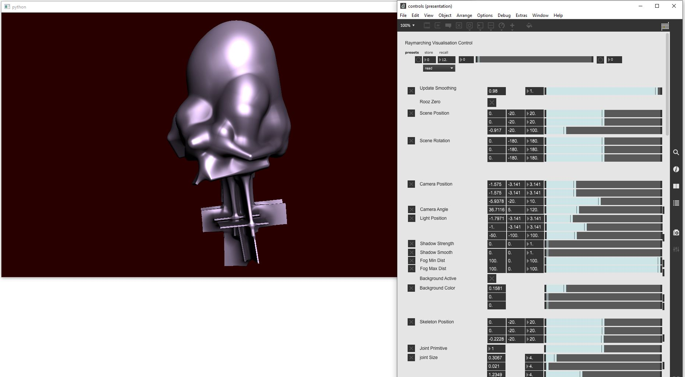

# AI-Toolbox - Motion Visualisation - Raymarching



Figure 1. Screenshot of the Raymarching tool. The window on the left shows the visual output of the tool.  The window on the right is a Max/MSP patch that demonstrates how to send OSC messages to control the Raymarching tool. 

## Summary

This Python-based tool implements the Raymarching rendering method to translate motion capture data into abstract 3D graphics. The visualisation translates the joints and edges of a single performer who is motion captured into basic geometric objects that are described by signed distance functions. By traversing this space pixel by pixel and checking for collisions with the objects, an image is generated in which the performer appears as a continuous surface whose shape can very continuously between humanoid and amorphous. The rendering process can be interactively controlled by sending the tool OSC messages. 

### Installation

The tool runs within the *premiere* anaconda environment. For this reason, this environment has to be setup beforehand.  Instructions how to setup the *premiere* environment are available as part of the [installation documentation ](https://github.com/bisnad/AIToolbox/tree/main/Installers) in the [AI Toolbox github repository](https://github.com/bisnad/AIToolbox). 

The tool can be downloaded by cloning the [MotionVisualisation repository](..). After cloning, the tool is located in the MotionVisualisation / Raymarching directory. 

### Directory Structure

Raymarching (contains tool specific python scripts)

- controls (contains an example Max/MSP patch for interactively controlling the tool)
- data
  - configs (skeleton topologies and joint rotation corrections for different motion capture systems)
  - media (contains media used in this Readme)


## Usage
#### Start

The tool can be started either by double clicking the `deepdream.bat` (Windows) or `deepdream.sh` (MacOS) shell scripts or by typing the following commands into the Anaconda terminal:

```
conda activate premiere
cd Raymarching
python raymarching.py
```

During startup, the tool loads a configuration file that describes the topology of the skeleton whose motion capture data will be received for rendering. The configuration file also specifies a joint filter to exclude parts of the skeleton from rendering and a list of rotation corrections for the rendered joints. By default, a configuration for the XSens motion capture system is loaded from the local data/configs directory. Also during startup, the resolution of the output window is defined. By default, this resolution is set to 720 x 405 pixels. This resolution can be changed at any time while running the tool by simply resizing the rendering window.  

To load a different configuration file and/or chose a different initial resolution, the following source code has to be modified in the file `raymarching.py`.

```
joint_settings_file = "data/configs/xsens_joint_settings.json"

...

window_size = [720, 405]
```

The string variable assigned to the variable `joint_settings_file` specifies the path to the skeleton configuration file. The list of integer values assigned to the variable `window_size` specifies the initial resolution of the rendering window.

#### Functionality

The tool employs the Raymarching rendering technique to visualise motion capture data of a solo performer. The joints and edges represented in the data are displayed as a collection of geometric primitives and fused together into a singular abstract form. Apart from the performer's joint and edges, several static objects can also be displayed through Raymarching.  The Raymarching technique is based on the principle of a ray that scans a virtual space for collisions with geometric primitives. The ray is emitted for each pixel of the image to be produced. The geometric primitives are mathematically described as functions that calculate the distance between a point in space and the primitive’s surface. The method is computationally demanding, but offers the possibility that primitives can be easily deformed and merged into intricate and seamless surfaces. This possibility can be exploited to vary the appearance of the dancing figure and the static objects between humanoid, amorphous, and platonic forms. Apart from rendering the geometric primitives as surface shapes, the tool also implements basic lighting calculation for a single point light. Lighting include ambient light, diffuse light, specular light, ambient occlusion, hard shadows, and soft shadows. While running, the tool receives motion capture data as OSC messages. In addition, the parameters of the rendering process can also be controlled by sending OSC messages to the tool.

### Graphical User Interface

The tool provides a minimal GUI for displaying the currently rendered image (see Figure 1 left side). 

### OSC Communication

The tool receives OSC two types of OSC messages. The first type of messages contains the motion capture data of the performer who is visualised. The second type of messages control the rendering process by changing some of its parameters. The second type of parameters can be further distinguished into parameters that affect the overall appearance of the entire rendered scene, parameters that change the appearance of individual joints and edges, and parameters that change the appearance of static objects. 

The following OSC messages contain motion capture data (here, N represents the number of joints):

- joint positions as list of 3D vectors in world coordinates: `/mocap/0/joint/pos_world <float j1x> <float j1y> <float j1z> .... <float jNx> <float jNy> <float jNz>` 
- joint rotations as list of Quaternions in world coordinates: `/mocap/0/joint/rot_world <float j1w> <float j1x> <float j1y> <float j1z> .... <float jNw> <float jNx> <float jNy> <float jNz>` 

The following OSC messages affect the overall appearance of the rendered scene:

- The scaling between previous and current motion data to control the level of motion smoothing. A smoothing factor of 0.0 causes the current motion data to fully replace the previous ones. A smoothing factor of 1.0 causes the current motion data to be ignored. `/mocap/updatesmoothing <float smooting_factor>`

- A flag indicating whether the root joint should be fixed at the origin position or not. A zero_flag of 1 fixes the root joint at the origin position. A zero_flag of 0 keeps the root joint at the position obtained in the motion data. `/mocap/skelposworld <integer zero_flag>`
- A 3D position in cartesian coordinates that offsets the position of all joints, edges, and objects in the scene: `/vis/sceneposition <float posx> <float posy> <float posz>`
- A 3D position in cartesian coordinates  that offsets the position of only the joints and edges in the scene: `/vis/skelposworld <float posx> <float posy> <float posz>`
- A quaternion rotation that offsets the rotations of all joints, edges, and objects in the scene: `/vis/scenerotation <float rotw> <float rotx> <float roty> <float rotz>`
- A 3D position in spherical coordinates that specifies the position of the camera from which the scene is observed. The camera moves on the surface of a circle while always pointing towards the origin of the scene: `/vis/camposition <float azimuth> <float elevation> <float radius>`
- The focal length of the camera: `/vis/camangle <float angle>`
- A 3D position in spherical coordinates that specifies the position of a point light that illuminates the scene: /vis/lightposition `<float azimuth> <float elevation> <float radius>`
- `A factor that controls the strength of shadow calculations. For a factor of 0.0, shadow calculations are turned off. /vis/shadowstrength <float shadow_strength>`
- A factor that controls the balance between hard and soft shadows. A factor of 0.0 represents a hard shadow. The larger the factor, the softer the shadow becomes. `/vis/shadowsmooth <float shadow_softness>`
- A distance from the camera at which the fog effect is minimal: `/vis/fogmindist <float min_distance>`
- A distance from the camera at which the fog effect is maximal: `/vis/fogmindist <float max_distance>`
- RGB values that specify the color of the scene background: `/vis/bgcolor <float red> <float green> <float blue>`
- A full scene static distortion effect that rotates the raymarching ray with increasing depth in the xy plane: Ray Rotation: `/vis/rayrotation <float rot_value>`
- A full scene dynamic distortion effect that oscillates the y coordinate of the ray marching ray based on depth and time: Ray Wiggle: `/vis/raywiggle <float wiggle_value>`

Several OSC messages affect the appearance of the joints. For some of the messages, it is possible but facultative to specify the index of an individual joint. If no index is specified, then the appearance of all joints is affected. The following OSC messages are available:

- select a geometric primitve (by index) for one or all joints. The following primitives are available: -1: no primitive, 0: sphere, 1: box, 2: capsule, 3: cylinder. If the primitive index is not a full number, then the resulting primitive is a morph between the two primitives with neighbouring indices: `/vis/jointprimitive (<integer joint_index>) <float primitive_index>`
- set the size of the geometric primitive for one or all joints. The size has three values whose effect varies with the chosen primitive. For sphere, sizex is the radius, sizey and sizez are ignored, for box: sizex, sizey, and sizez are width, height, and depth, for capsule and cylinder, sizex is the radius and sizez the length, sizey is ignored: `/vis/jointsize (<integer joint_index>) <float sizex><float sizey><float sizez>`
- specifies the amount of shape rounding that is applied to the geometric primitives for one or all joints: `/vis/jointround (<integer joint_index>)  <float round>`
- specifies for one or all joints the distance at which their shapes merge into each other: `/vis/jointsmooth (<integer joint_index>)  <float smooth>`
- specifies for all joints the color in RGB: `/vis/jointcolor <float red> <float green> <float blue>`
- specifies for all joints the ambient occlusion color in RGB: `/vis/jointocclusioncolor <float red> <float green> <float blue>`
- specifies for all joints the contribution of ambient light to the overall lighting: `/vis/jointambientscale <float scale>`
- specifies for all joints the contribution of diffuse light to the overall lighting: `/vis/jointdiffusescale <float scale>`
- specifies for all joints the contribution of specular light to the overall lighting: `/vis/jointspecularscale <float scale>`
- specifies for all joints the specular light exponent: `/vis/jointspecularpow <float pow>`
- specifies for all joints the contribution of ambient occlusion to the overall lighting: `/vis/jointocclusionscale <float scale>`
- specifies for all joints the distance range of ambient occlusion: `/vis/jointocclusionrange <float range>`
- specifies for all joints the resolution of the ambient occlusion calculations: `/vis/jointocclusionresolution <float resolution>`

The following OSC messages affect the appearance of the edges:

- select a geometric primitve (by index) for one or all edges. The following primitives are available: -1: no primitive, 0: sphere, 1: box, 2: capsule, 3: cylinder. If the primitive index is not a full number, then the resulting primitive is a morph between the two primitives with neighbouring indices: `/vis/edgeprimitive (<integer edge_index>) <float primitive_index>`
- set the size of the geometric primitive for one or all edges. The size has three values whose effect varies with the chosen primitive. For sphere, sizex is the radius, sizey and sizez are ignored, for box: sizex, sizey, and sizez are width, height, and depth, for capsule and cylinder, sizex is the radius and sizez the length, sizey is ignored. Contrary to joints and objects, sizez is not an absolute value but a scaling factor for the length of the edge. The lengh is automatically calculated based on the distance between the connected joints: `/vis/edgesize (<integer edge_index>) <float sizex><float sizey><float sizez>`
- specifies the amount of shape rounding that is applied to the geometric primitives for one or all edges: `/vis/edgeround (<integer edge_index>)  <float round>`
- specifies for one or all edges the distance at which their shapes merge into each other: `/vis/edgesmooth (<integer edge_index>)  <float smooth>`
- specifies the distance at which the shapes of edges merge into the shapes of joints: `/vis/jointedgesmooth <float smooth>`
- specifies for all edges the color in RGB: `/vis/edgecolor <float red> <float green> <float blue>`
- specifies for all edges the ambient occlusion color in RGB: `/vis/edgeocclusioncolor <float red> <float green> <float blue>`
- specifies for all edges the contribution of ambient light to the overall lighting: `/vis/edgeambientscale <float scale>`
- specifies for all edges the contribution of diffuse light to the overall lighting: `/vis/edgediffusescale <float scale>`
- specifies for all edges the contribution of specular light to the overall lighting: `/vis/edgespecularscale <float scale>`
- specifies for all edges the specular light exponent: `/vis/edgespecularpow <float pow>`
- specifies for all edges the contribution of ambient occlusion to the overall lighting: `/vis/edgeocclusionscale <float scale>`
- specifies for all edges the distance range of ambient occlusion: `/vis/edgeocclusionrange <float range>`
- specifies for all edges the resolution of the ambient occlusion calculations: `/vis/edgeocclusionresolution <float resolution>`

The following OSC messages affect the appearance of the static objects:

- object position: `/vis/objectposition <integer object_index> <float posx> <float posy> <float posz>`
- object rotation: `/vis/objectrotation <integer object_index> <float rotw> <float rotx> <float roty> <float rotz>`
- select a geometric primitive (by index) for one or all objects. The following primitives are available: -1: no primitive, 0: sphere, 1: box, 2: capsule, 3: cylinder, 4 - 17: different 3D fractals. If the primitive index is not a full number and below 3.0, then the resulting primitive is a morph between the two primitives with neighbouring indices: : `/vis/objectprimitive (<integer object_index>) <float primitive_index>`
- set the size of the geometric primitive for one or all objects. The size has three values whose effect varies with the chosen primitive. For sphere, sizex is the radius, sizey and sizez are ignored, for box: sizex, sizey, and sizez are width, height, and depth, for capsule and cylinder, sizex is the radius and sizez the length, sizey is ignored. The effect of the size values varies for the fractal primitives: `/vis/objectsize (<integer object_index>) <float sizex><float sizey><float sizez>`
- specifies the amount of shape rounding that is applied to the geometric primitives for one or all objects: `/vis/objectround (<integer object_index>)  <float round>`
- specifies for one or all objects the distance at which nearby object shapes merge into each other: `/vis/objectsmooth (<integer object_index>)  <float smooth>`
- specifies the distance at which nearby object shapes merge into joints and edges: `vis/skelobjectsmooth <float smooth>`
- object amplitude: `/vis/objectamplitude (<integer object_index>) <float ampx><float ampy><float ampz>`
- object frequency: `/vis/objectfrequency (<integer object_index>) <float freqx><float freqy><float freqz>`
- object phase: `/vis/objectphase (<integer object_index>) <float phasex><float phasey><float phasez>`
- specifies for one or all objects the color in RGB: `/vis/objectcolor (<integer index>) <float red> <float green> <float blue>`
- specifies for one or all objects the ambient occlusion color in RGB: `/vis/objectocclusioncolor  (<integer index>) <float red> <float green> <float blue>`
- object ambient scale: `/vis/objectambientscale (<integer object_index>)  <float scale>`
- object diffusion scale: `/vis/objectdiffusescale (<integer object_index>)  <float scale>`
- object specular scale: `/vis/objectspecularscale (<integer object_index>)  <float scale>`
- specifies for one or all objects the specular light exponent: `/vis/objectspecularpow (<integer object_index>) <float pow>`
- specifies for one or all objects the contribution of ambient occlusion to the overall lighting: `/vis/objectocclusionscale (<integer object_index>)  <float scale>`
- specifies for one or all objects the distance range of ambient occlusion: `/vis/objectocclusionrange (<integer object_index>)  <float range`>
- specifies for one or all objects the resolution of the ambient occlusion calculations: `/vis/objectocclusionresolution (<integer object_index>)  <float resolution>`

By default, the tool receives its OSC messages from any IP address and on port 9005. To change this port, the following source code in the file clustering_interactive.py has to be modified:

    osc_receive_ip = "0.0.0.0"
    osc_receive_port = 9005

The string value assigned to the variable `osc_receive_ip` represents the IP address from which the OSC messages are received from. The string "0.0.0.0" represents any IP address.
The integer value assigned to the variable `osc_receive_port` represents the port in which the tool receives the OSC messages.

### Limitations and Bugs

- The computational demands for Raymarching is very high and depends on resolution as well as the number and type of geometric primitives. 